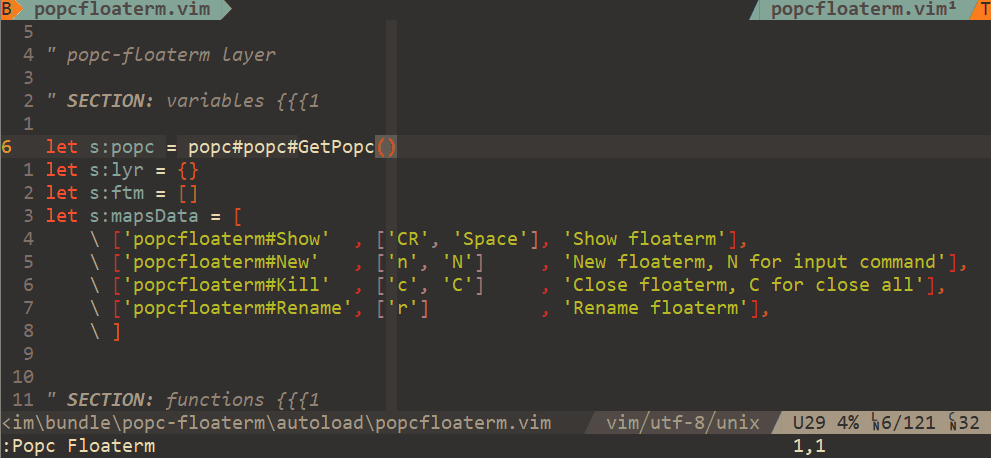

[popc](https://github.com/yehuohan/popc) plugin for [vim-floaterm](https://github.com/voldikss/vim-floaterm).

## Usage

```
:Popc Floaterm
```

<div align="center">

</div>


More usage help in [popc.txt](https://github.com/yehuohan/popc/blob/master/doc/popc.txt).

